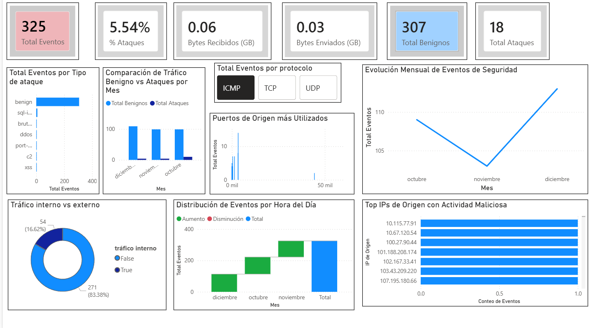

# Análisis de Tráfico de Red - Kaggle
# Descripción del Proyecto
Este proyecto consiste en un análisis integral de datos de ciberseguridad y tráfico de red obtenidos de Kaggle. El objetivo principal fue transformar datos crudos en información estratégica para identificar patrones de tráfico, cuellos de botella operativos y posibles anomalías en la red
# Tecnologías Utilizadas 
- Power BI: Creación de dashboards interactivos y visualización de datos.
- Power Query: Procesos de ETL (Extracción, Transformación y Carga) y limpieza de datos.
- DAX: Creación de medidas y columnas calculadas para métricas avanzadas.
Excel: Validación de datos y estructuración inicial.
# Procesos Realizados
* Limpieza de Datos (Data Wrangling): Tratamiento de valores nulos y normalización de formatos utilizando Power Query.
* Modelado de Datos: Estructuración de tablas para optimizar el rendimiento de las consultas en Power BI.
* Análisis Exploratorio (EDA): Identificación de tendencias y comportamientos recurrentes en el tráfico de red.
* Visualización: Diseño de un tablero dinámico enfocado en KPIs de cumplimiento y eficiencia operativa.
  

-Se identificó que la gran mayoría de los eventos registrados son de carácter benigno (307 eventos), lo que representa una tasa de ataques relativamente baja del 5.54% sobre el total.
- El análisis de "Tráfico interno vs externo" revela que el 83.38% de las conexiones (271 eventos) provienen de fuentes externas, lo que sugiere la necesidad de reforzar las políticas del firewall perimetral.
- Se detectó que la actividad maliciosa está distribuida de manera uniforme entre las principales direcciones IP de origen (como la 10.115.77.91), permitiendo la creación de una lista negra (blacklist) para mitigar riesgos.
- Mediante el uso de segmentación por protocolos, se observa que el tráfico se distribuye entre ICMP, TCP y UDP, permitiendo identificar qué servicios son más vulnerables a intentos de intrusión
